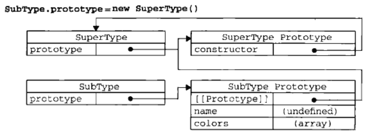

###解读javascript高级程序设计第六章《面向对象的程序设计》

**ECMAScript** 定义对象：无序属性的集合，其属性可以包含基本值、对象或者函数。即键值对，值可能为数据、函数。

**理解对象--创建对象--继承**

**一.对象**

**ECMAScript**有两种属性：数据属性和访问器属性

**1、数据属性**

数据属性包含一个数据值的位置，在这个位置可以读取与写入值，4个特性 

	⑴configurable：表示能否通过delete删除属性重新定义，能否修改属性的特性，能否把属性修改为访问器的属性。默认为true.

	当把属性的Configurable设置为false后，该属性不能通过delete删除，并且也无法再将该属性的Configurable设置回true，此过程未不可逆的。对应的Object.freeze()函数的实现也类似，不可逆。

	⑵enumerable:true|false。表示属性可否被枚举，默认true。 

	⑶writable: true|false。表示属性是否可写，默认true 

	⑷value:属性的值

例：定义对象只读不可写的方法之一

	var test = { 
	_Name : null, 
	_Age : 0, 
	_Hi:'hi',

	//_Name的读写

	set name(name) {this._Name = name;}, 
	get name() {return this._Name;}, 

	//_Age的读

	get age() {return this._Age;},

	// _Hi的读写

	set hi(str) {this._Hi = str;},
	get hi() {return this._Hi;}
	} 

扩展：可修改已经定义的

	Object.defineProperty(test,"age",{//设置数据属性
   		Writable:true,//设置为false，name属性为只读的
    	Configurable:true, //设置为false，则name属性不能通过delete删除
		set:function(num){this._Age=num;}
	});

**使用此方法在严格模式下可能会报错**

注：相关函数

	Object.defineProperty：IE8是第一个实现此函数的版本 
	Object.defineProperties：IE9+、Firefox4+、Safari5+、Opera12+、Chrom 
	Object.getOwnPropertyDescriptor：IE9+、Firefox4+、Safari5+、Opera12+、Chrom
[http://blog.csdn.net/yu766588220/article/details/51556628](http://blog.csdn.net/yu766588220/article/details/51556628)

**2、访问器属性**

	Configurable：同数据属性的Configurable 

	Enumerable: 同数据属性的Enumerable 可枚举即可用for-in循环

	get:function(){} 属性被读取的时候调用，支持的浏览器IE9+、Firefox4+、Safari5+、Opera12+、Chrom 

	set:function(newValue){} 属性被写入的时候调用, 支持的浏览器IE9+、Firefox4+、Safari5+、Opera12+、Chrom

**访问属性不能直接定义，必须要使用Object.defineProperty()定义**

访问器属性的常见方法，设置一个属性会导致其他属性的变化。

**二、创建对象**

constructor   instanceof操作符检验对象类型 

**！构造函数中对于函数方法的定义，要将函数定义在外部，避免不相等情况，如例**

	function Person(name){

		this.name=name;

		this.sayName=(new) function(){

			alert(this.name);
		}
	} 
如同上例的两个实例person1.sayName!=person2.sayName.

正确展示

	function Person(name){
		this.name=name;
		this.sayName=sayName;
	}
	function sayName(){
		alert(this.name);
	}

##原型模式

每个对象都有一个prototype属性，这个属性是一个指针，指向一个包含可以由特定类型的所有实例共享的属性和方法，即prototype就是通过调用构造函数而创建的那个对象实例的原型对象，实现所有对象实例共享属性与方法

isPrototypeOf方法:	确定对象之间是否存在这种关系

	已知 Person.prototype = = person1.constructor.prototype//true
	例如 Person.prototype.isPrototypeOf(person1)//true

ES5中多了Object.getPrototypeOf()方法取得对象原型

	Object.getprototypeOf(person1)==Person.prototype//true

执行某个对象的属性时候会执行两次搜索，先自身检测是否有该属性，若无则再从自己的原型上搜索是否有该属性。自身的属性优先级高于原型链上对应的属性。

hasOwnProperty()方法可以清晰判断该对象的属性是来自自身还是来自原型
	
	person1.hasOwnProperty('name')//自身属性true，原型属性false

**in操作符**

单独使用时，in操作符会在通过对象能够访问给定属性时返回true(实例属性或者原型属性均可)

**Object.keys**	ES5	返回一个包含所有可枚举属性的字符串数组，即键的数组。

	Object.keys(Preson.prototype)// ["name","age","job","sayName"]
	Object.keys(person1)// ["name","age"]

**Object.getOwnPropertyNames()**获得所有实例属性，不管是否可以枚举
	
	Object.getOwnPropertyNames(Person.prototype)//["construtor","name","age","job","sayName"]
	Object.getOwnPropertyNames(People)//["length", "name", "arguments", "caller", "prototype"]
	Object.getOwnPropertyNames(person1)//["name"]

**更优化的写法**

	function Person(){
	}
	Person.prototype={
		constructor:Person,//此句中Person的原型对象被覆盖(被重写)，而构建这个原型对象的构造器是Object，所以如果不加上constructor：Person,则实例化的person1.constructor==Object。
							//此处类似与Person.prototype=new Object{};...
		name:'human',
		age:'100',
		sayName:function(){
			alert(this.name);
		}
	}
**此类做法重设constructor导致它的[Enumerable]特性被设置为true，而默认情况下原生的constructor属性是不可枚举的，因此要使用	ES5的Object.defineProperty()**

	Object.defineProperty(Person.prototype,"constructor",{
		enumerable:false,
		value:Person
	})

**实例中的指针只指向原型，不指向构造函数，所以原型一旦被修改，实例会与最初原型关联，但切断了与修改后的原型的联系，因此实例需要重新定义。**
例如

	function Person(){}
	var friend=new Person();
	Person.prototype={
		constructor:Person,
		name:"human"
	}
	var f1=new Person();
	friend.name//undefine 最初原型属性
	f1.name//human 修改以后的原型属性

**不推荐在Object Array String这些基本包装类型的原型上创建新的方法**

**使用修改原型对象的存在的突出问题是，如果对象的属性是原型对象的属性，那么修改这个属性以后如果会影响到自身的值，则原型对象也被修改，从而影响了其他由这个对象原型创造出的对象** 例如

	function Person(){}
	Person.prototype={
		constructor:Person,
		name:["human","body"],
	}
	var friend1 =new Person();
	var friend2 =new Person();
	friend1.name.push("Chinese");//push操作改变了数组本身
	friend1.name//[human,body,Chinese]
	friend2.name//[human,body,Chinese]
	friend2.shift();//shift操作改变了数组本身
	friend2.name//[body,Chinese]
	friend1.name//[body,Chinese]

**组合使用构造函数模式与原型模式：构造函数模式用于定义实例属性，原型模式用于定义方法和共享属性**

	//实例属性
	function Person(name,age){
		this.name=name,
		this.age=age,
		this.friends=['human','body'],
	}
	//完善版本
	if(typeof this.sayName!='function'){
		//共享方法
		Person.prototype={
			constructor:Person,
			sayName：function(){
				alert(this.name);	
			}
		}
	}

**寄生构造函数模式：创建对象并返回此对象**

**稳妥构造函数模式 ：1、新创建的实例方法不引用this；2、不使用new操作符调用构造函数**

**组合继承？？**

Object.create()

**原型链？？**

经典例子方便理解

	function Super(name){
		this.name=name，
		this.colors=['red','blue'],
	}

	Super.prototype.sayName=function(){
 		console.log(this.name);
	};

	function Sub(name,age){
		//继承属性
		Super.call(this,name);// Sub使用Super的方法与属性，第二次调用
		this.age=age;
	}

	//继承方法
	Sub.prototype = new Super();//第一次调用

 	Sub.prototype.sayAge =function(){ //赋予新的方法
		console.log(this.age);
	};

	var instance1=new Sub('jack',29);
    instance1.colors.push("black");
	instacnce1.colors//[red,blue,black]
	instance1.sayName();//jack
	instance1.sayAge();//29

	var instance2=new Sub('Mike',24);
	instance2.colors//[red,blue]
	instance2.sayName//Mike
	instance2.sayAge//24

第一次调用

第二次调用

